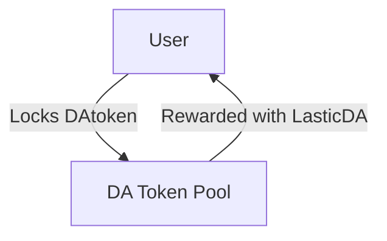
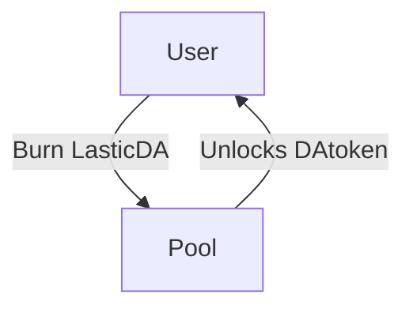
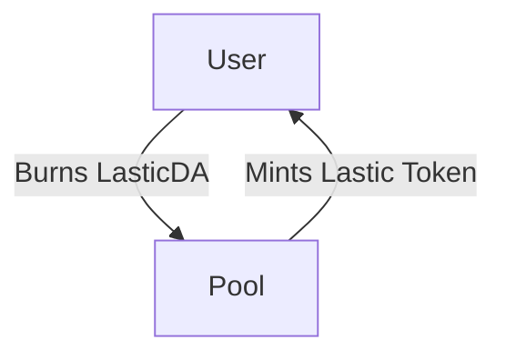
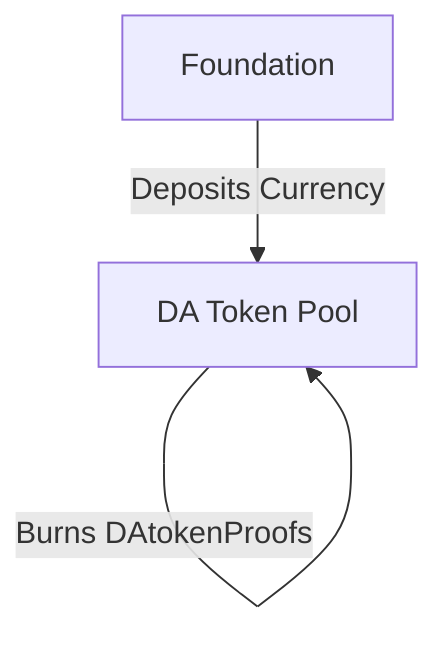
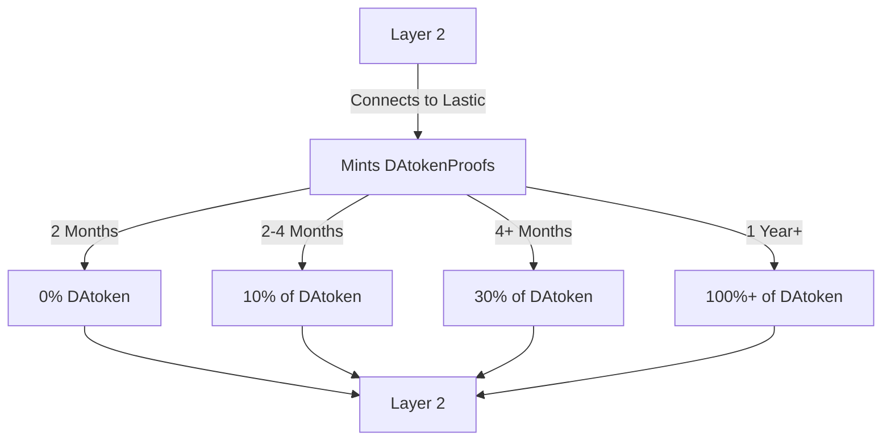
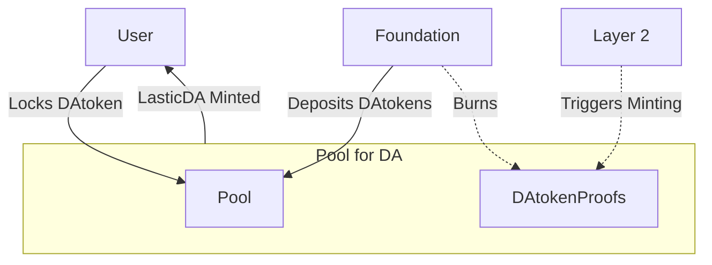
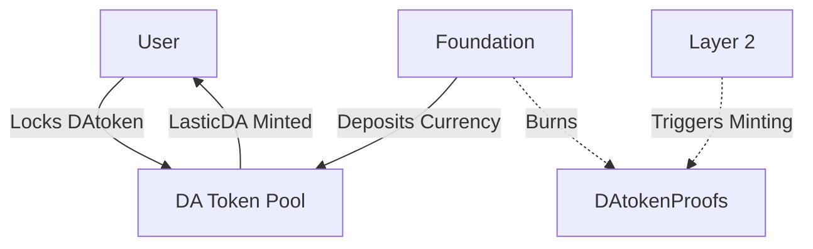

# Tokenomics Model

### Tokenomics Model Description

### Key Terms
- **DA Provider**: Example - DA1
- **DA Token**: Example - DAtoken
- **LasticDA**: Reward Token for the specific protocol
- **Proof Token**: DAtokenProof

#### Background
- **Data Availability Competition**: With data availability (DA) becoming highly affordable and accessible, DA providers are in fierce competition to attract Layer 2 solutions to use their platforms.
- **Current Incentive Mechanisms**: DA providers currently rely on business development teams to incentivize Layer 2 solutions with tokens, a process that is lengthy and expensive.
- **Automating the Process with Lastic**: Lastic aims to streamline and automate this onboarding process, reducing costs and increasing efficiency.

#### Model Overview
This tokenomics model is designed to function from three key perspectives, each with specific expectations and interactions:

1. **Users (Token Holders)**
   - **Participation**: Normal users who hold DA tokens can participate by depositing their `DAtoken` into the DA provider's pool.
   - **Incentive**: In return for locking their `DAtoken`, users receive `LasticDA`, a reward token which is gradually minted over time. When they have enough of `LasticDA` token they can at any time switch back for the `DAtoken`, thus `LasticDA` represents `DAtoken`'s locked liquidity inside the DA pool.
   - **Benefit**: This mechanism incentivizes users to deposit their DA tokens, thereby increasing the pool's value and contributing to the overall ecosystem. In the early stages these users will be especially crucial, especially for jump starting the whole economic game. Thus it's quite important that we design the mechanics in such a way that we incentivize early or long term backers.

2. **DA Providers**
   - **Streamlined Incentives**: Instead of manually negotiating with Layer 2 solutions, DA providers can leverage the automated tokenomics model.
   - **Foundation Contributions**: The DA foundation can contribute to the pool by depositing its currency (`DAtokens`), which in turn burns `DAtokenProofs`, maintaining the system's balance.

3. **Layer 2 Solutions**
   - **Engagement**: Layer 2 solutions connect to the Lastic platform, triggering the minting of `DAtokenProofs` based on their submission duration.
   - **Spam Prevention**: To prevent abuse, the creation of `DAtokenProofs` is based on the length of the Layer 2's engagement, with longer commitments yielding more tokens.
   - **Rewards**: The model ensures that genuine, long-term Layer 2 engagements are rewarded proportionally, encouraging sustainable and meaningful participation.

#### Dependencies of token generation
- **DAtokenProofs**: 
    - Note `DAtokenProof` token has a 1:1 exchange rate with the `DAtoken`, `DAtokenProof` is a ficticious token which we use to track how much money has been allocated to the Layer 2s. Every time `DAtokenProof` is minted some money proportional to the minting should be allocated from the `DAtoken` pool to the L2.
    - Layer 2 solutions’ contributions are incentivized either through a tiered system or a time curve, where longer participation periods result in higher rewards of `DAtokenProofs`.  
    - Minting of the `DAtokenProofs` should be also dependent on how much is the user deposit to foundation deposit ratio to Layer2 minting the DAtokenProofs ratio. For example: If there are a lot of Layer2's, but the deposits of `DAtoken` in the pool is small, each individual L2 should get proportionally less rewards. Likewise if you have lot's of user depositing, but no foundations depositing the tokens, the payouts for the L2s should be proportionally small, because there are already a lot of users that are expecting the rewards, but not a lot of rewards to go around. However early users that deposited into the pool should still get rewards from the new users that are coming into the pool. When the DA foundation's comes along and deposits `DAtokens` that action burns `DAtokenProofs`.
    - _These are only assumption - Fix if there are some issues._
- **LasticDA**: Users deposit `DAtoken` into the DA pool and receive `LasticDA` tokens, minted in proportion to how long they were staking, how many `DAtokens` are already in the pool and the number of `DAtokenProofs` generated. _These are only assumption - Fix if there are some issues._

#### Combining Multiple DA Providers
- **Unified Token**: The `Lastic` token aggregates the value of `LasticDA` tokens from various DA providers, creating a cohesive and scalable ecosystem. The exact formula is yet unknown, but maybe something like:

$$ T_{Lastic} = C_1 * T_{LasticDA1} + ... + C_N * T_{LasticDAN} $$

This tokenomics model aims to automate and optimize the onboarding process for Layer 2 solutions, incentivize user participation, and streamline the interaction between DA providers, foundations, and Layer 2 solutions, ultimately fostering a more efficient and competitive DA marketplace.

### User Flow

1. **Deposit && Lock of Tokens**
    - Users deposit `DAtoken` into the DA1 pool.
    - The deposited `DAtoken` is locked in the pool.
2. **Mint Reward Tokens**
    - Users receive `LasticDA` in exchange for locking their tokens.
    - `LasticDA` is minted when `DAtokenProofs` are generated.
    - The amount of `LasticDA` minted depends on:
        - The total value in the pool.
        - The quantity of `DAtokenProofs` generated.
3. **Unlock `DAtokens` with burning `LasticDA`**
    - Over time when the user will get the `LasticDA` tokens they will get rewarded 

> The exact mechanics of how exactly the `LasticDA` tokens would be minted and how many of them would have to be burned in exchange for the amount of how many `DAtokens` would be unlocked is still unkown.

4. **Creation of the Lastic token**
    - Mechanism of burning the LasticDA token can mint people the Lastic token, and vice versa
    - A cleaver mechanism has to be devised for 

> Note: these mechanics have to yet to be properly defined

### DA Foundation Flow

1. **Deposit Currency**
    - The DA foundation deposits its currency into the pool in exchange for burning the `DAtokenProofs`.
2. **Burn Proof Tokens**
    - `DAtokenProofs` are burned when the foundation deposits it's currency.

### Layer 2 Flow

1. **Mint Proof Tokens**
    - `DAtokenProofs` are minted based on the duration of Layer 2 submissions to the DA provider.
    - and based on how much tokens are in the pool, what are the ratios between user deposits and 
2. **Spam Prevention**
    - To prevent spam, the minting of `DAtokenProofs` considers the submission duration:
        - Short-term submissions yield fewer tokens.
        - Longer submissions yield more tokens (e.g., 2-4 months: 10% of `DAtoken`).

> Note: the following represents only an example.

### Combined View

### Integration with Multiple DA Providers

The `LasticDA` token represents the aggregate value of `LasticDA` tokens from various DA providers.

## Modeling Dynamics with Python

To model the value of the `LasticDA` token over time:

1. **Linear Growth of DAtoken**: The value of `DAtoken` rises linearly.
2. **User Inflows**: User deposits cause small deviations, appearing as noise that never falls below zero.
3. **Foundation Influence**: The DA foundation's deposits cause step-like increases in the `DAtoken` pool value.
